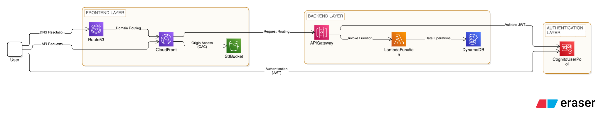

# Task Manager App

[](https://nextjs.org/)
[](https://react.dev/)
[](https://www.typescriptlang.org/)
[](https://tailwindcss.com/)
[](#-architectural-highlights)

A modern Task Management application built with **Next.js App Router**, demonstrating production-grade state management, accessibility (a11y), and performance optimizations.

This repository implements practical production patterns, utilizing custom hooks, smooth UX/UI transitions, zero-hydration flashes, and comprehensive keyboard accessibility.

> **Note**: This is the v2 (AWS Serverless) version.
> Check out the original [v1 (Netlify SPA)](https://github.com/dntgh/nextjs-task-manager) for comparison.

---

## 🚀 Core Features

*   **✨ Task CRUD**: Create, read, edit, and delete tasks with assigned priority levels (High, Medium, Low).
*   **📅 Smart Date Management**: Timezone-safe due dates with relative indicators (*Today*, *Tomorrow*, *Yesterday*, *In X days*, *Overdue*) and automatic local midnight parsing.
*   **🔄 Robust State Management**: AWS API-integrated state management paired with a real-time toast notification system.
*   **⚡ Zero-Flash Hydration**: Animated skeleton layouts during client-side data fetching to eliminate SSR hydration content flashes and layout shifts.
*   **🔍 Advanced Search & Filtering**: Real-time search and status categorization (*All*, *Active*, *Completed*).
*   **🎨 Accessibility & Theming**: WCAG-compliant interactions, including focus-trapping modals, accessible form controls, and responsive Light/Dark modes.

---

## 🛠️ Tech Stack

This project was built using the following core technologies, pinned to the exact versions found in `package.json`:

*   **Framework**: Next.js `16.2.9` (App Router)
*   **Language**: TypeScript `^5` (Strict Mode compliant)
*   **Library**: React `19.2.4` / React DOM `19.2.4`
*   **Styling**: Tailwind CSS `^4` (with native `@tailwindcss/postcss` setup)
*   **Authentication**: AWS Amplify `^6.18.0` (Cognito integration)
*   **Notifications**: Sonner `^2.0.7`
*   **Icons**: Customized, lightweight inline SVGs.

---

## 📦 Installation & Local Setup

Get the project up and running locally by following these steps:

1.  **Clone the Repository**:
    ```bash
    git clone https://github.com/dntgh/nextjs-task-manager-v2-aws.git
    cd nextjs-task-manager-v2-aws/
    ```
    *(Lưu ý: Bạn hãy kiểm tra lại URL github này xem đã đúng username của bạn chưa nhé)*

2.  **Install Dependencies**:
    ```bash
    npm install
    ```

3.  **Environment Setup**:
    Create a `.env.local` file in the root directory and add the following:
    ```env
    NEXT_PUBLIC_API_URL=your_api_gateway_endpoint
    NEXT_PUBLIC_AWS_COGNITO_USER_POOL_ID=your_user_pool_id
    NEXT_PUBLIC_AWS_COGNITO_APP_CLIENT_ID=your_client_id
    ```

4.  **Run Development Server**:
    ```bash
    npm run dev
    ```
    Open [http://localhost:3000](http://localhost:3000) with your browser to see the application.

5.  **Production Build**:
    ```bash
    npm run build
    npm run start
    ```

---

## 📐 Architectural Highlights

This application is engineered as a production-ready, serverless-first system. Key highlights include:

*   **AWS API-Only Architecture**: Decoupled backend operations utilizing API Gateway, Lambda, and DynamoDB for consistent data management.
*   **Memoized Optimization**: Intelligent UI rendering using `useMemo` and custom debouncing to ensure high performance.
*   **Accessibility (a11y)**: WCAG-compliant implementation, featuring focus-trapping modals and keyboard navigation.
*   **Serverless Auth**: Robust identity management via Amazon Cognito.

> **Note:** For a deep dive into the system design, detailed data lifecycles, and machine-readable metadata, please refer to our [System Architecture Documentation](docs/architecture/01_architecture_and_data_flow.md).

---

## 📑 Documentation
*   **Post-deployment Assessment**: [View Report](docs/PostDeployment_Assessment_v1.0.pdf)

---

## ☁️ AWS Infrastructure
The application is deployed on AWS with the following serverless architecture:

**Frontend:**
*   **Hosting**: Amazon S3 (`dnt-nextjs-task-manager-frontend`) for static web hosting
*   **CDN**: CloudFront (`dnt-nextjs-task-manager-dev-website`) for global content delivery
*   **Domain**: Route 53 (`dotung.site`) for custom domain management

**Backend:**
*   **API Gateway**: REST API (`dnt-nextjs-task-manager-api`) for request routing and JWT validation
*   **Compute**: AWS Lambda (`dnt-nextjs-task-manager-crud-lambda`) with Node.js 22.x runtime
*   **Database**: Amazon DynamoDB (`dnt-nextjs-task-manager-tasks-table`) for NoSQL data storage
*   **Authentication**: Amazon Cognito User Pool (`dnt-nextjs-task-manager-user-pool`) for user management

**Security & Monitoring:**
*   **IAM**: Lambda execution role with least-privilege permissions
*   **CloudWatch**: Log group for Lambda function monitoring and debugging

### 🏗️ System Architecture

