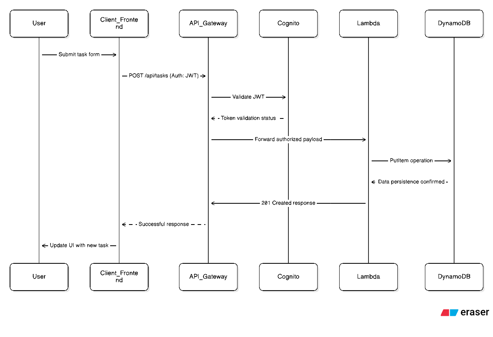

# 1. System Architecture & Data Flow Assessment

**Date:** 2026-07-10
**Project:** Task Manager Application
**Environment:** Production
**Architecture Pattern:** Serverless Monolith (Next.js)

---

## 1.1. System Architecture Diagram

Below is the conceptual architecture of the deployed Task Manager application.


**Core Components Description:**
* **Frontend Layer:** Custom domain `dotung.site` served via **CloudFront** (CDN) with origin in **S3 Bucket** (`dnt-nextjs-task-manager-frontend`), strictly secured by Origin Access Control (OAC) to prevent direct public access.
* **Authentication Layer:** Amazon Cognito User Pool handling user registration, authentication, and JWT issuance.
* **API & Routing Layer:** Amazon API Gateway serving as the entry point, routing all incoming requests to the compute layer.
* **Compute Layer:** A single AWS Lambda function (`dnt-nextjs-task-manager-crud-lambda`) handling all backend logic, routing, and CRUD operations embedded within the Next.js framework.
* **Database Layer:** Amazon DynamoDB serving as the NoSQL data store for tasks and user metadata.

---

## 1.2. Core Data Flow (Create Task Lifecycle)

Below is the core data flow.


1. **Authentication:** The Client authenticates against **Amazon Cognito** and receives a JSON Web Token (JWT).
2. **Request Initiation:** The Client sends an HTTP `POST /api/tasks` request to **Amazon API Gateway**, embedding the JWT in the `Authorization` header.
3. **Authorization:** API Gateway validates the JWT signatures against Cognito. Unauthenticated requests are rejected immediately with an HTTP `401 Unauthorized` status.
4. **Compute Trigger:** Upon successful validation, API Gateway forwards the request payload and context to the **AWS Lambda** function.
5. **Data Persistence:** The Node.js execution context inside the Lambda function processes the business logic and invokes the AWS SDK to perform a `PutItem` operation on the **Amazon DynamoDB** table.
6. **Response Cycle:** DynamoDB acknowledges the write operation to Lambda. Lambda returns the formatted payload (HTTP 201 Created) back to API Gateway, which delivers the final response to the Client.

---

## 1.3. Resource Configuration

| AWS Service | Physical Resource Name / ID | Configuration Details |
| :--- | :--- | :--- |
| **AWS Lambda** | `dnt-nextjs-task-manager-crud-lambda` | Runtime: `nodejs22.x`, Memory: `128 MB`, Timeout: `3s` |
| **Amazon DynamoDB** | `dnt-nextjs-task-manager-tasks-table` | NoSQL, Billing: On-Demand |
| **Amazon API Gateway**| `dnt-nextjs-task-manager-api` (`j29n101ah8`) | REST API, Edge-optimized |
| **Amazon Cognito** | `dnt-nextjs-task-manager-user-pool` (`us-east-1_ZwwWbcexW`) | User Authentication |
| **CloudFront** | `dnt-nextjs-task-manager-dev-website` (`E1ZKXRDUBRCLCK`) | Distribution: `d2qbjxgo2qsmoa.cloudfront.net` |
| **Amazon S3** | `dnt-nextjs-task-manager-frontend` | Static Web Hosting Origin |
| **Route 53** | `dotung.site` | Custom Domain Management |
| **AWS IAM** | `dnt-nextjs-task-manager-crud-lambda-role-u6qddxbh` | Lambda Execution Role |
| **AWS CloudWatch** | `/aws/lambda/dnt-nextjs-task-manager-crud-lambda` | Log Group |

---

## 1.4. Machine-Readable Infrastructure Metadata (For AI Agents)

```json
{
  "project": "Task Manager App",
  "architecture_style": "Serverless Monolith (Next.js)",
  "metadata_version": "1.0.0",
  "resources": {
    "frontend_cdn": {
      "type": "AWS::CloudFront::Distribution",
      "id": "E1ZKXRDUBRCLCK",
      "domain": "dotung.site",
      "origin_s3": "dnt-nextjs-task-manager-frontend"
    },
    "compute": {
      "type": "AWS::Lambda::Function",
      "name": "dnt-nextjs-task-manager-crud-lambda",
      "memory_mb": 128
    },
    "database": {
      "type": "AWS::DynamoDB::Table",
      "name": "dnt-nextjs-task-manager-tasks-table"
    },
    "api": {
      "type": "AWS::ApiGateway::RestApi",
      "id": "j29n101ah8"
    },
    "auth": {
      "type": "AWS::Cognito::UserPool",
      "id": "us-east-1_ZwwWbcexW"
    },
    "security": {
      "type": "AWS::IAM::Role",
      "name": "dnt-nextjs-task-manager-crud-lambda-role-u6qddxbh"
    },
    "monitoring": {
      "type": "AWS::Logs::LogGroup",
      "name": "/aws/lambda/dnt-nextjs-task-manager-crud-lambda"
    }
  },
  "connections": [
    "User -> Route 53 (DNS) -> CloudFront -> S3",
    "User -> CloudFront -> API Gateway -> Lambda -> DynamoDB",
    "User -> Cognito (Auth)"
  ]
}
```

---

## 1.5. Implementation Status

* **Infrastructure Layer:** Fully provisioned via manual configuration (Click-ops).
* **Frontend Layer:** Fully implemented (Next.js + Amplify Auth).
* **Backend Layer:** Infrastructure is provisioned (API Gateway, Lambda, DynamoDB), but the backend logic is **not currently managed within this codebase**. The Lambda function requires deployment of application-specific business logic.
* **Data Persistence:** Application enforces AWS API-only mode. All data operations require valid `NEXT_PUBLIC_API_URL` and authenticate via Cognito JWT tokens.
